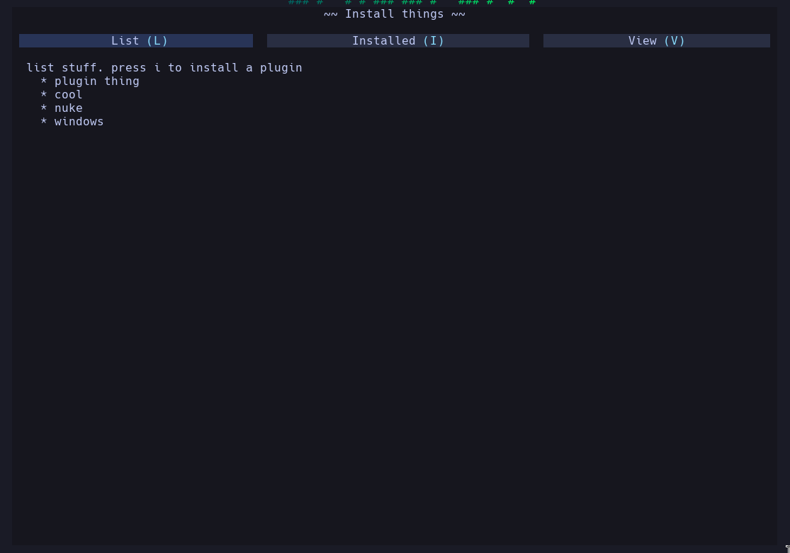
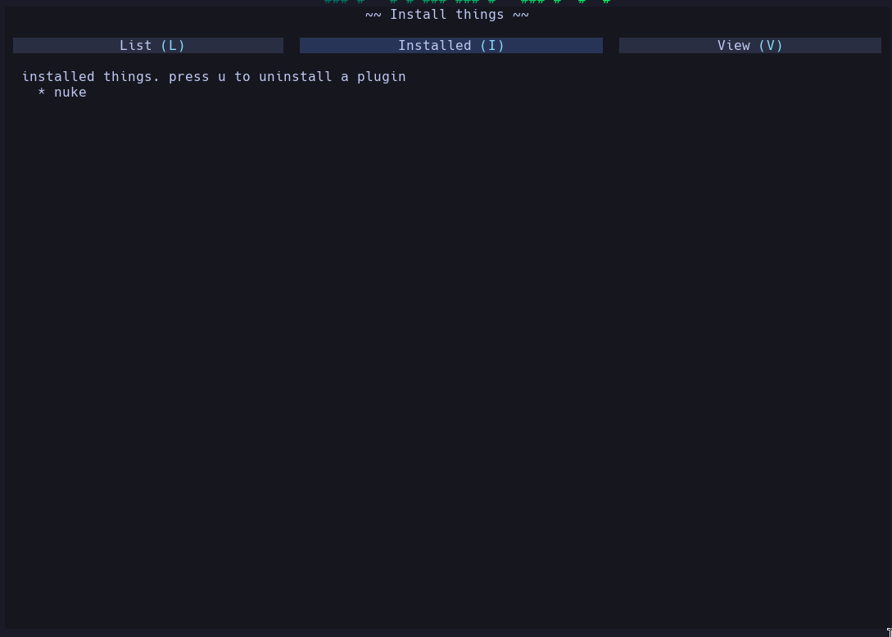
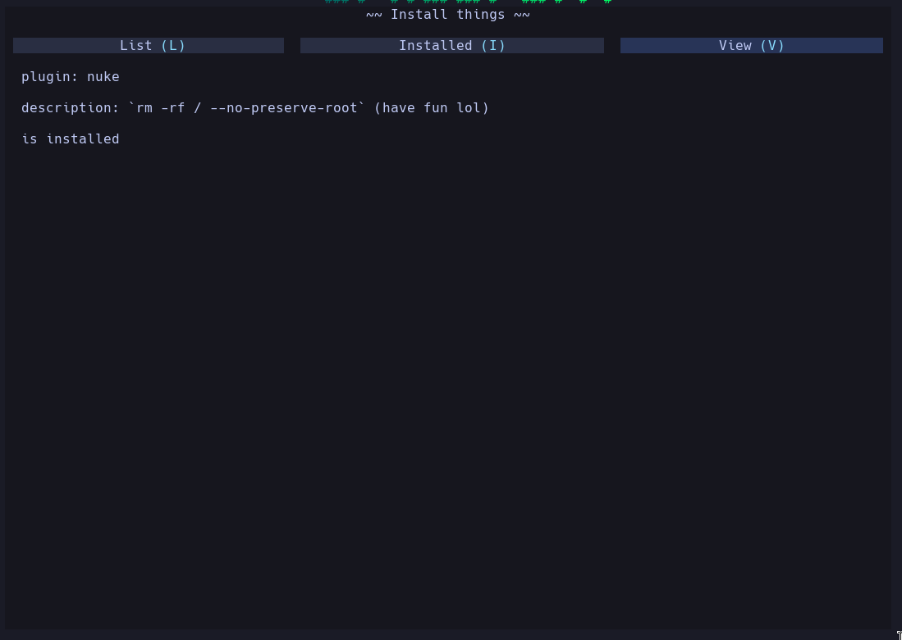

# Banana example

This is just a really quick and simple plugin I whipped up to showcase some of banana's functionality

The following screenshots are of the plugin ui:

Home page:



Install page:



View thing page:



## Install

To install with lazy.nvim, just use:

```lua
{
    "CWood-sdf/banana-example",
    dependencies = { "CWood-sdf/banana.nvim" },
    opts = {}
}
```

Then run it with the command: `InstallThings`

## Banana Features

The main features it shows are:

- Flex rendering (the topbar is controlled with `display:flex` and `flex-grow:1`)
- `loadNmlTo` (currently the system is a bit clunky and will probably be actually designed in banana 0.2)
- api is separated from the ui components
- components with banana (the `banana/installer/_plugin_el.nml` file is a reusable component)

In my opinion, it is _MUCH_ more obvious what each page of the ui is going to look like when reading the nml than in a regular neovim plugin.
